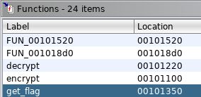
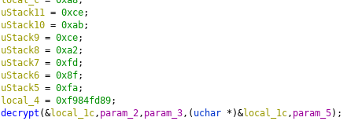
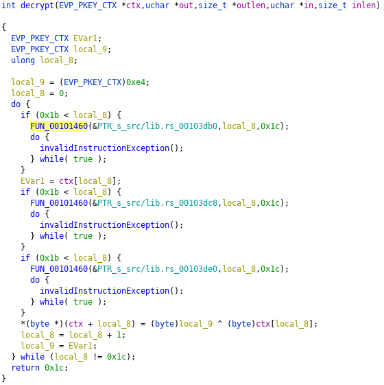
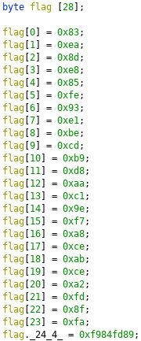

# Rusty

Here we have 2 ways to solve this challenge !

## Solution 1: Linking

If you were an absolute madlad, you could just choose to link a C program to the functions. This is not particularly difficult but I doubt it would occur to most at first.

Make sure you build with `gcc link_solution.c libgetting_rusty.so`.

check `link_solution.c`

## Solution 2: Reversing

### Reversing the get_flag function

Open the library  in Ghidra :



Traverse into it a bit and we find:
1. A huge block of bytes (indicating an array of some sort) and
2. A call to `decrypt` passing a pointer to the first byte of our block.



### Reversing the decrypt function

Below is the entire decompiled `decrypt` function here:



The do-while bounds prevent this condition from occurring, and these would normally
be optimised out by LLVM.

Discarding the bounds checks and the unused parameters, this function is quite straightforward. To write some
pseudocode:

```text
local_9 = 0xe4
local_8 = 0
do {
    EVar1 = ctx[local_8]
    ctx[local_8] = local_9 ^ ctx[local_8]
    local_8++
    local_9 = EVar1;
} while (local_8 != 0x1c)
```

This appears to be a simple dragging XOR. This do-while can additionally be turned into a for loop quite trivially.

### Getting the flag

We'll write a C implementation because Ghidra provides us with a pretty neat decompiler utility.

First, we retype local_1c to a byte[28] and rename it to flag:



We then copy this over to our solution file to construct our main (fixing the last entry little-endianly):

```
int main() {
    char flag [28];

    flag[0] = 0x83;
    flag[1] = 0xea;
    flag[2] = 0x8d;
    flag[3] = 0xe8;
    flag[4] = 0x85;
    flag[5] = 0xfe;
    flag[6] = 0x93;
    flag[7] = 0xe1;
    flag[8] = 0xbe;
    flag[9] = 0xcd;
    flag[10] = 0xb9;
    flag[11] = 0xd8;
    flag[12] = 0xaa;
    flag[13] = 0xc1;
    flag[14] = 0x9e;
    flag[15] = 0xf7;
    flag[16] = 0xa8;
    flag[17] = 0xce;
    flag[18] = 0xab;
    flag[19] = 0xce;
    flag[20] = 0xa2;
    flag[21] = 0xfd;
    flag[22] = 0x8f;
    flag[23] = 0xfa;
    flag[24] = 0x89;
    flag[25] = 0xfd;
    flag[26] = 0x84;
    flag[27] = 0xf9;

    decrypt(&flag);
    printf("%.28s\n", flag);
}
```

Then, using our pseudocode from earlier, we write the decrypt function:

```
void decrypt(char *flag) {
    char temp;
    char local_9 = 0xe4;
    char local_8 = 0;
    for (int i = 0; i < 28; i++) {
        temp = flag[i];
        flag[i] = local_9 ^ flag[i];
        local_8++;
        local_9 = temp;
    }
}
```

Bundling it all together and compiling, we get the flag. You can compile `solution.c` to this result.