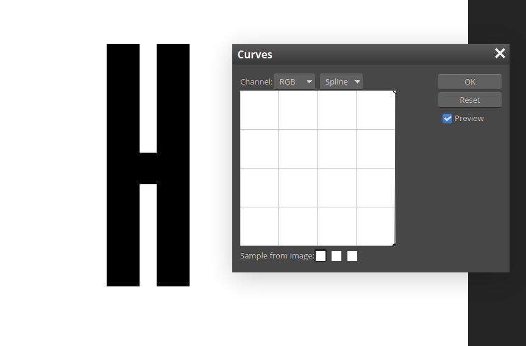

# Loop

## Description
Here we are given the file `loop.gif`

## Solution
First we open the file in photohop or gimp or online tool (https://www.photopea.com/) and it will split each frame in a single layer then all we have to do is change the crurves of the image 
   
 
and the flag will show up !

