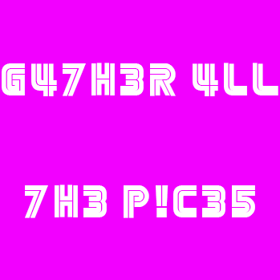

# Scattered

## Description
Hmm something looks odd here 
flag format : h4x0r{what_you_find_here}

## Solution
in the archive `catchEm_all.tar.gz` we find multiple files which are png files 
all we have to do is stack all the images and we get a single image which contains the flag  
 
